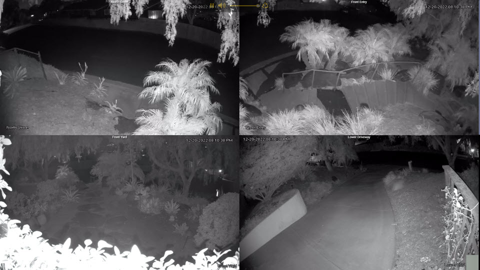

# RTSP Streaming Project

This project is a tool for streaming video from an RTSP source (such as a camera) over the network using Node.js, Golang. This project was inspired by [vladmandic/stream-rtsp](https://github.com/vladmandic/stream-rtsp)



## Prerequisites

- [Node.js (version 18.12.1)](https://nodejs.org/en/download/)
- [Golang](https://golang.org/doc/install)
- [Yarn](https://yarnpkg.com/getting-started/install)

## Installation

1. Clone this repository:

   ```powershell
   git clone https://github.com/your-username/rtsp-stream.git
   ```

2. Navigate to the project directory:

   ```powershell
   cd rtsp-stream
   ```

3. Install the required Node packages:

   ```powershell
   yarn install
   ```

4. Build the project:

   ```powershell
   yarn build
   ```

## Configuration

1. Copy the `.env.template` file to `.env` and add your RSTP server username and password.

   ```powershell
   cp .env-template .env
   ```

2. Run the following command to create a HTTPS certificate. Note this script requires [OpenSSL](https://www.openssl.org/source/) to be installed.

   ```powershell
   yarn init:https
   ```

3. Add your RSTP streams under the `streams` object.
   Example:

   ```json
   "streams": {
      "street": {
        "description": "North Street",
        "debug": false,
        "url": "rtsp://192.168.1.120/cam/realmonitor?channel=1&subtype=1"
      }
    }
   ```

## Usage

To start the streaming server, run the following command to start the streaming server and open the browser:

```powershell
yarn start
```

## Contributing

We welcome contributions to this project. If you have an idea for a new feature or have found a bug, please open an issue on the [GitHub issue tracker](https://github.com/your-username/rtsp-streaming/issues).

If you would like to contribute code, please fork the repository and submit a pull request. Please make sure to follow the project's coding style and write tests for your code.

## License

This project is licensed under the MIT License - see the [LICENSE](LICENSE) file for details.
